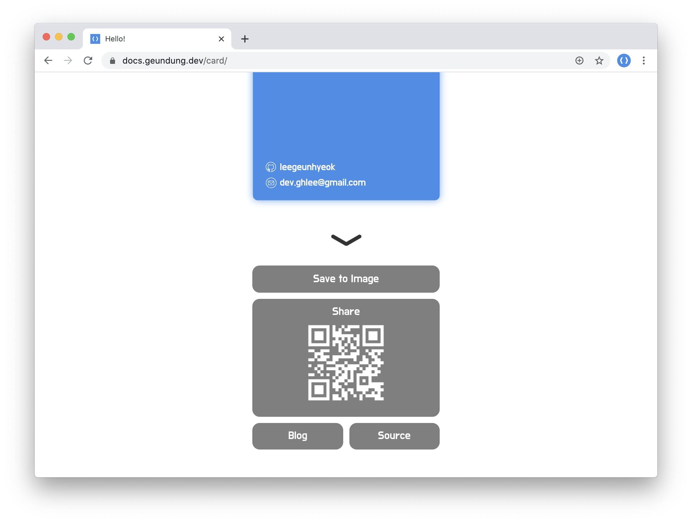

# card

🤙 Web based business card

[Try now!](https://card-roan.vercel.app)


<br>


## Feature

- Introduce about me
- Menu
  - Save business card to `High Quality` image
  - Share URL (QRCode)
  - Blog and Source repository link

### Result sample

- Original (600x948), png
- This is down sampled (50%), jpg


## Development

```bash
npm i
npm run dev
```

## Build

Check `/dist` directory

```bash
npm run build
```

## Resource

- images
  - email.svg [Adi Sînchetru](https://iconscout.com/contributors/adi-sinchetru)
  - github.svg [Adi Sînchetru](https://iconscout.com/contributors/adi-sinchetru)

## License

[MIT](./LICENSE)
